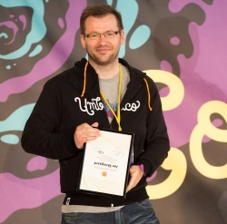
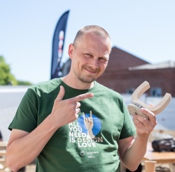

---?color=#F5D9FF

@title[Building Gr8 Packages]

@snap[east text-bold]

# Building gr8 packages

@snapend

---?image=template/img/dave-woestenborghs_smaller.jpg&position=right&size=auto 100%

@title[Introduction Dave]

@snap[west span-50]

### Hello

@ul[squares text-08]

- Dave Woestenborghs
- 42 years old
- From Belgium
- Works at We Are You
- Using Umbraco since 2008
  @ulend
  @snapend

@snap[east span-45]

@snapend

---?image=template/img/dave-woestenborghs_smaller.jpg&position=right&size=auto 100%

@title[Introduction Dave]

@snap[west span-50]

### Active Community member

@ul[squares text-08]

- Active forum member
- ~~3x~~ 4x MVP
- Core contributor
- Award winning package dev
- Member of the PR team
- Member of the BUUG board
- Part of 24 days in Umbraco

  @ulend
  @snapend

@snap[east span-45]

@snapend

---

@title[Looking for authors]

@snap[north span-40]

### Looking for authors

@snapend

@snap[south-west span-50 text-center]
Jan Skovgaard

@snapend

@snap[south-east span-50 text-center]
Chriztian Steinmeier

@snapend

---?color=linear-gradient(80deg, #FFC927 50%, white 50% )

@title[Agenda]

@snap[west span-40 text-center]

## What will we cover

@snapend

@snap[east span-50 text-right]

@ul[squares text-08]

- Summary V8 changes
- What defines a great package
- Migrating packages from V7
- Angular changes
- C# changes
- Packaging

  @ulend

@snapend
